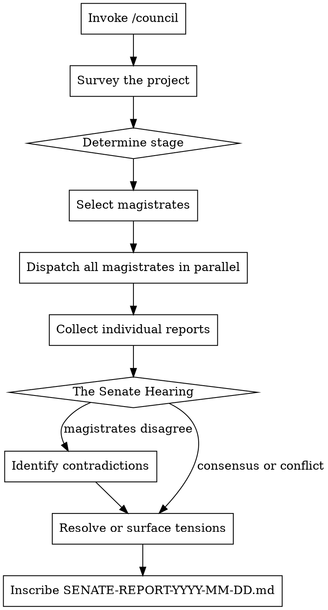

# The Council of Rome

**Core principle:** No single magistrate sees the whole Republic. The Senate endures because power is divided, perspectives are forced into collision, and no man's judgment goes unchallenged.

The Council of Rome is a suite of five evaluation frameworks, each embodied by a Roman magistrate with a distinct mandate, methodology, and temperament. Individually, each magistrate delivers a focused, thematically rigorous review. Convened together, they produce a Senate-grade assessment that no single perspective could achieve.

## The Five Magistrates

| Magistrate       | Command       | Historical Figure            | Domain                                      |
|------------------|---------------|------------------------------|----------------------------------------------|
| **The Censor**   | `/censor`     | Marcus Porcius Cato the Elder | Structural integrity, code quality, austerity |
| **The Tribune**  | `/tribune`    | Gaius Sempronius Gracchus     | User advocacy, accessibility, the people's voice |
| **The Praetor**  | `/praetor`    | Lucius Cornelius Sulla        | Security, compliance, contracts, legal exposure |
| **The Augur**    | `/augur`      | Marcus Tullius Cicero         | Strategic risk, market omens, timing, viability |
| **The Legatus**  | `/legatus`    | Gnaeus Pompeius Magnus        | Operations, logistics, deployment, endurance  |

## Invocation

```
/council                               # Convene all five magistrates
/council ~/projects/my-venture         # Full council on a specific project
/council . --magistrates=censor,augur  # Convene specific magistrates only
/senate                                # Alias for /council

# Individual magistrates (see their respective skill files):
/censor                                # The Censor's Decree
/tribune                               # The Tribune's Appeal
/praetor                               # The Praetor's Inquisition
/augur                                 # The Augur's Reading
/legatus                               # The Legatus's Campaign
```

## How the Council Convenes

When `/council` is invoked, the following sequence executes:



### Step 1: Dispatch

Each magistrate evaluates the project independently using their own skill file, persona, and methodology. They do not see each other's findings during evaluation.

### Step 2: The Senate Hearing

After all magistrates report, the Council phase begins. This is where the real value emerges — not in individual findings, but in the **collisions between magistrates**.

Look for these tensions:

| Tension                          | Example                                                                |
|----------------------------------|------------------------------------------------------------------------|
| **Speed vs. Safety**             | The Legatus demands faster deployment. The Praetor demands more audit. |
| **User desire vs. Structural integrity** | The Tribune wants a feature. The Censor says the architecture cannot support it. |
| **Market timing vs. Readiness**  | The Augur says the window is closing. The Legatus says the supply lines aren't ready. |
| **Growth vs. Compliance**        | The Augur sees opportunity. The Praetor sees regulatory exposure.      |
| **Simplicity vs. Robustness**    | The Tribune wants fewer steps. The Censor wants more validation.       |

These tensions are not bugs — they are the point. Surface them explicitly in the Senate Report.

### Step 3: The Verdict

The Council issues a collective verdict after weighing all magistrates' findings:

| Verdict                        | Meaning                                                                          |
|--------------------------------|----------------------------------------------------------------------------------|
| **IMPERIUM GRANTED**           | The project may proceed with full authority. Minor edicts only.                  |
| **CONDITIO SENATUS**           | The Senate grants conditional approval. Named conditions must be met.            |
| **AD REFERENDUM**              | Referred back for fundamental work. The Senate will reconvene after corrections. |
| **INTERCESSIO**                | A magistrate has vetoed. A critical blocker exists that overrides all progress.  |
| **SENATUS CONSULTUM ULTIMUM** | Emergency decree. The project poses active risk and must be halted immediately.  |

## Senate Report Format

Inscribe to `[project-dir]/SENATE-REPORT-YYYY-MM-DD.md`:

```markdown
# SENATE REPORT: [Project Name]

> *"Senatus Populusque Romanus"*
> The Senate and People of Rome

**Date of Session**:       YYYY-MM-DD
**Stage of Construction**: [BLUEPRINT | FOUNDATION | STRUCTURE | MONUMENT]
**Magistrates Convened**:  Censor, Tribune, Praetor, Augur, Legatus
**Senate Verdict**:        [IMPERIUM GRANTED | CONDITIO SENATUS | AD REFERENDUM | INTERCESSIO | SENATUS CONSULTUM ULTIMUM]

---

## The Senate's Declaration
[3-5 sentences. The unified assessment of the Council. Where the magistrates agree, state it plainly. Where they conflict, name the tension.]

---

## Magistrate Summaries

### The Censor (Cato) — Structural Integrity
**Individual Verdict**: [DELENDA EST | BACK TO THE QUARRY | PROCEED UNDER EDICT | WORTHY OF THE REPUBLIC]
**Critical Findings**: X RUINA, X FLAGITIUM
**Chief Concern**: [One sentence]

### The Tribune (Gracchus) — The People's Voice
**Individual Verdict**: [VOX POPULI DENIED | BREAD WITHOUT CIRCUSES | THE PEOPLE ENDURE | THE PEOPLE ARE SERVED]
**Critical Findings**: X INIURIA, X GRAVAMEN
**Chief Concern**: [One sentence]

### The Praetor (Sulla) — Law and Exposure
**Individual Verdict**: [NOXIUS | SUB IUDICE | CAVEAT EMPTOR | IUS CIVILE SATISFIED]
**Critical Findings**: X CRIMEN, X DELICTUM
**Chief Concern**: [One sentence]

### The Augur (Cicero) — The Omens
**Individual Verdict**: [AUSPICIA ADVERSA | CAELUM INCERTUM | FAVOURABLE WINDS | FORTUNA FAVET]
**Critical Findings**: X OMEN SINISTRUM, X SIGNUM DUBIUM
**Chief Concern**: [One sentence]

### The Legatus (Pompey) — The Campaign
**Individual Verdict**: [LEGION UNFIT | SUPPLY LINES CUT | MARCH READY | INVICTA]
**Critical Findings**: X CLADES, X IMPEDIMENTUM
**Chief Concern**: [One sentence]

---

## Where the Magistrates Clash

### Tension 1: [Name of tension]
**Between**: [Magistrate A] and [Magistrate B]
**The conflict**: [What they disagree about and why]
**The Council's guidance**: [How to navigate this tension — what to prioritize and why]

### Tension 2: [Name of tension]
...

---

## The Senate's Edicts
*Ordered by priority. The first edict must be resolved before the second is addressed.*

1. **EDICTUM-001**: [Concrete order with clear acceptance criteria]
   - **Originating magistrate(s)**: Censor, Praetor
   - **Deadline class**: IMMEDIATE | BEFORE LAUNCH | NEXT QUARTER

2. **EDICTUM-002**: [...]
   ...

---

## What the Senate Does Not Condemn
[Brief, measured acknowledgment of where no magistrate raised objection. Not praise — absence of condemnation.]

---

> *"Senatus consultum: let the record show that this project has been assessed by the full Council of Rome. The magistrates have spoken. The Republic endures."*
```

## Relationship Between Skill Files

```
council-of-rome/
├── COUNCIL-OF-ROME.md        ← You are here (orchestration & Senate session)
├── CENSORS-DECREE.md          ← /censor — Structural integrity (Cato)
├── TRIBUNES-APPEAL.md         ← /tribune — User advocacy (Gracchus)
├── PRAETORS-INQUISITION.md    ← /praetor — Security & compliance (Sulla)
├── AUGURS-READING.md          ← /augur — Strategic risk (Cicero)
└── LEGATUS-CAMPAIGN.md        ← /legatus — Operations & logistics (Pompey)
```

Each magistrate skill file is fully self-contained and can be invoked independently. The Council skill orchestrates them together and adds the Senate Hearing layer.

## Edge Cases

| Situation                           | Behavior                                                                           |
|-------------------------------------|------------------------------------------------------------------------------------|
| Only one magistrate requested       | Route to that magistrate's individual skill. No Senate session needed.              |
| Two or three magistrates requested  | Run those magistrates, hold abbreviated Senate session on their intersection only.  |
| Magistrates unanimously agree       | Note the consensus but express suspicion. Unanimous agreement often means blind spots. |
| Project is pre-code (idea only)     | Augur and Tribune are primary. Censor and Legatus operate in advisory mode only.    |
| Previous Senate report exists       | Compare verdicts. Note what improved, what decayed, what was ignored.               |
| User asks "which magistrate?"       | Describe all five in one sentence each. Let the user choose. Do not choose for them.|

## The Council's Discipline

The Council maintains credibility through internal disagreement. If all five magistrates return the same verdict with no tensions, something is wrong. Real projects have genuine tradeoffs — speed vs. safety, user desire vs. structural limits, opportunity vs. risk. If the Council is not surfacing these tensions, the Council is not doing its job.

The value of the Council is not five reviews stapled together. It is the collisions between them.
